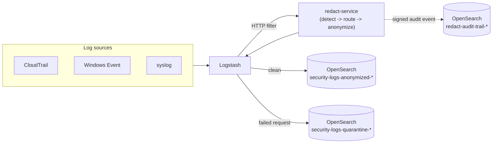
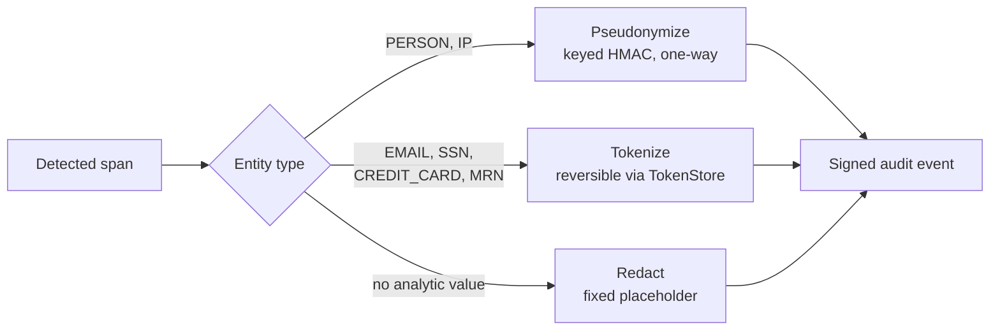

# REDACT


PII/PHI detection and anonymization for heterogeneous security telemetry. A three-layer detection ensemble (regex, Microsoft Presidio NER, Shannon entropy) sits behind a taxonomy-driven anonymization router (redaction, keyed pseudonymization, reversible tokenization) and a field-level drift detector that catches a field silently starting to carry personal data it never carried before.



Every number in this README came out of an actual executed run, not a projection — run `validate.py` yourself and check. There's no real data anywhere in this repository; the entire corpus is synthetic, generated with a fixed seed.


*Real output, not staged — a tokenize/detokenize round trip and the syslog coverage test suite, both run against this exact codebase.*

This is the reference implementation behind two related but separately written pieces of work: a practitioner-oriented book chapter (IntechOpen, *Data Privacy in Practice*) and an empirical research paper. Check each publication for its own scope — this repo is the shared technical foundation underneath both, not a copy of either.

## Does this actually work? Run this and see.

```bash
python src/generate_logs.py --n 10000 --out data/synthetic_logs.jsonl --dirty-ratio 0.3
python validate.py
```

`validate.py` answers exactly that question in one script: 18 checks against every major claim in this README, run fresh each time, no reliance on "it worked when I tested it before." Every check is a real assertion against real output — not a print statement dressed up to look like one. A failing check exits non-zero and prints exactly what failed.

What it checks, in order: ground-truth offsets in the generated corpus, detection recall/precision against defensible floors (the rigid-format entity types should hit 100% recall, and do), whether anonymization preserves correlation and round-trips correctly through tokenization, whether anonymized CloudTrail output stays valid JSON (a regression check for the overlapping-span bug described below), whether audit signatures verify and reject tampering, and whether the taxonomy drift detector catches a freshly injected drift scenario without false-positiving on stable data. **As of the Bug 11 fix (2026-08-07, see below and `BUGS_AND_FIXES.md`), 16 of 18 pass.** The 2 known failures both live in the drift-detection section (Section 5), and they're an expected, documented side effect of the flattened-username layer's partial (~50%) recall producing sample-to-sample noise against the fixed 5% drift threshold — not a regression, and not swept under the rug: see "Taxonomy drift detection" below and Bug 11 in `BUGS_AND_FIXES.md` for the full explanation. The other 16, including both safety-critical categories — audit-trail signature verification/tamper-rejection, and anonymization correlation/reversibility — pass clean.

## Setup

```bash
python3 -m venv venv
source venv/bin/activate    # on Windows: venv\Scripts\activate
pip install -r requirements.txt
python -m spacy download en_core_web_lg
```

## Reproduce the results

```bash
python src/generate_logs.py --n 10000 --out data/synthetic_logs.jsonl --dirty-ratio 0.3
python src/evaluate.py --data data/synthetic_logs.jsonl
python src/analyze_entropy.py data/synthetic_logs.jsonl
```

Everything is seeded (`Faker.seed(42)`, `random.seed(42)`), so a fresh run reproduces the same dataset and the same numbers.

## Does it hold up on real data, not just synthetic?

```bash
cd validation/real_data
bash download_loghub.sh
python inject_and_evaluate.py
```

The synthetic corpus above is close to a best-case scenario for any detector, since its own generation templates are the patterns the regex layer was designed against. `validation/real_data/` asks the harder question directly: run against five real, independently collected, unmodified log datasets nobody here wrote, does the same format-sensitivity gap show up? It does, every time. **Precision is not consistently lower on real data than synthetic** — an earlier version of this claim rested on a measurement bug (`validation/real_data/inject_and_evaluate.py` was missing a dedup step, double-counting agreeing regex+NER detections as false positives; see Bug 10 in `BUGS_AND_FIXES.md`). Corrected, three of five real datasets now measure *higher* precision than the synthetic baseline, and the two that don't — Zookeeper, Thunderbird — trace to the same internal-IP false-positive pattern in Finding 1 below, not a synthetic-to-real generalization gap. The flattened-username layer's recall gain replicates on real log text too. `validation/real_data/README.md` has the corrected numbers, what's actually being tested, and why eleven of sixteen candidate datasets were excluded rather than forced into producing a number.

## What was actually measured (single run, 10,000 synthetic entries, 3,002 containing PII)

Hardware: 1 vCPU, 4 GB RAM, no GPU. The numbers below are single-threaded Python throughput, **not** a benchmark of a production Logstash/OpenSearch deployment. That architecture is described in the chapter, and — contrary to what an earlier version of this README said — it's since been built and run end-to-end via Docker Compose (see "Docker Compose stack" below and `BUGS_AND_FIXES.md`), including a 100,000-line load test at 10x the original demo scale. Everything so far has run on one Docker Desktop machine against a single-node, single-shard OpenSearch instance, not a real multi-node production deployment, so treat these throughput numbers as exactly that: single-machine numbers, not a production benchmark.

**Post-Bug-9-fix note:** the corpus was regenerated after fixing `generate_logs.py`'s ground-truth labeling gap (Bug 9, see the Layer 4 section below) — same 10,000 entries, but 338 additional gold PERSON spans that had never been labeled before. All four rows below, including the two NER-dependent ones, are re-verified against the regenerated corpus (run locally by the user, since this repo's dev sandbox has no route to the spaCy model download).

| Condition | Micro-avg precision | Micro-avg recall | Micro-avg F1 | Throughput |
|---|---|---|---|---|
| Vanilla Presidio (off-the-shelf, default recognizer registry, no REDACT layers at all — `validation/baseline_presidio_default.py`, rerun 2026-08-08 against the current corpus) | 0.571 | 0.658 | 0.611 | ~111 events/sec |
| Regex only | 0.574 | 0.542 | 0.558 | ~65,100 events/sec |
| Regex + NER, tiered (NER skipped when regex already found something in the line) | 0.577 | 0.594 | 0.585 | ~261 events/sec |
| Regex + NER, field-gated (NER skipped only for regex-covered fields, not whole lines — engineering upgrade, excision version) | 0.592 | 0.707 | 0.644 | ~111 events/sec (11.34ms/line on the subset that differs from naive — see note below) |
| Regex + NER, naive (NER runs on every line) | 0.588 | 0.706 | 0.642 | ~112 events/sec (11.55ms/line on that same subset) |
| Regex + NER (naive) + flattened-username layer | 0.633 | 0.854 | 0.727 | ~109 events/sec |

**How REDACT's ensemble compares to installing Presidio and using it as-is:** the vanilla-Presidio row above answers a question the other four don't — what would an organization get by pulling in Presidio with zero customization? On this corpus, REDACT's regex+NER combination edges it out modestly (+0.017 precision, +0.048 recall), mostly because REDACT's regex layer perfectly recovers CREDIT_CARD (237/237 vs. vanilla's 162/237 — Presidio's built-in credit-card recognizer misses formats REDACT's regex catches). EMAIL/SSN/IP come out identical between the two approaches, since Presidio's built-in recognizers for those types already match REDACT's regex layer. PERSON detection is identical too, but for a different reason: REDACT's regex layer has no PERSON recognizer at all, so that entity type is 100% NER either way — vanilla Presidio's PERSON numbers (1074/612/1919) match REDACT's regex+NER PERSON numbers exactly by construction, not coincidence. Vanilla Presidio has no MRN recognizer at all, hence 0% recall on that type — expected, not a bug in the baseline. **The real gap opens with the flattened-username layer**: REDACT's full default ensemble reaches 0.854 recall against vanilla Presidio's 0.658, a 0.196 gain that has nothing to do with regex or NER tuning and everything to do with Finding 2 below. NER — Presidio's own or anyone else's — structurally misses flattened-username-format PERSON entities; closing that gap takes a dictionary-based layer, not a better NER model.

Recall on the "regex only" and NER rows dropped slightly versus the pre-Bug-9-fix numbers (naive NER recall went 0.745 → 0.706) — that's the corrected ground truth doing its job, not a regression. 338 previously-unlabeled PERSON spans are now counted, and none of the pre-existing layers found them, which is exactly why Layer 4 exists (see below). The flattened-username row is the full default ensemble as `detect_all()` actually runs it today (`use_flattened=True` by default), and it's the clearest single number in this table — recall jumps from 0.706 to 0.854 by adding one dictionary-based layer, at a throughput cost within noise of the NER step it rides alongside (~117 vs. ~119 events/sec; NER, not the new layer, is the bottleneck).

**The field-gated row has a two-part history, both from 2026-08-09, and the numbers above are pending a third run.** First run, against the original masking-based implementation (`_mask_regex_covered_fields`, since replaced — regex-covered field spans were replaced with same-length `#` placeholders rather than removed): the recall claim held up, the throughput claim didn't. PERSON recall came in at 0.356 (1067/2993 TP, up from tiered's 0.113) — nearly closing the entire gap to naive's 0.359, with *better* precision than naive besides (0.657 vs. 0.637, 557 FP vs. 612 — excluding regex-covered fields from NER's view also suppresses some of the spurious PERSON false-positives NER throws on structured numeric/IP content). Throughput did not hold up: ~100 events/sec, *slower* than naive's ~119, not faster as the original design predicted. Root cause: masking with same-length placeholders doesn't reduce what spaCy actually has to tokenize — the "skip NER entirely" path only fires when every alphabetic field value on a line is regex-covered, and a person's name essentially never lives in a field that also matches an SSN/EMAIL/CREDIT_CARD/IP/MRN regex, so that path rarely triggered and NER ran on the same-length text almost every time regardless, paying pure masking overhead on top.

**Second version, same day: `_build_ner_candidate` replaces masking with excision** — regex-covered field spans are physically removed and the surrounding text spliced back together, so the candidate NER actually receives is shorter than the original line (not just internally altered), with a `_remap_hit` helper translating any resulting span's offsets back to the original line's coordinates. Since NER cost scales with input length, this is the correct lever for an actual throughput improvement, not the same-length swap the first version was. Mechanically verified in this environment (`tests/test_field_level_gate.py`, rewritten the same day: confirms candidates are measurably shorter when something is excised, and — the correctness-critical piece — that offsets round-trip back to the exact original substring even when a hit sits after an excised span, not just in the trivial case).

**Re-measured against the real model, same day: the recall prediction held almost exactly, the throughput gap narrowed from 16.1% to 4.3% but the naive-vs-field-gated top-line numbers (~110 vs. ~114.5 events/sec) still looked like a small loss.** PERSON recall came in at 0.360 (vs. the masking version's 0.356) and precision at 0.658 (vs. 0.657) — confirming excision and masking hide the identical characters from NER, just structured differently, so the accuracy result carries over as expected.

**The remaining gap turned out to be a measurement artifact, not a real cost — closed by profiling instead of guessing further.** The first profiling pass measured only the field-gated candidate path (4,606 of 10,000 lines have a regex hit and enter it) and completely missed the other 5,394 lines, which fall through to the exact same plain `scan_ner(text)` call naive makes for every line — more than half the run's NER cost was invisible to the comparison. Fixed by instrumenting that fallthrough branch too and running the identical profiling against naive, giving a true controlled comparison on the SAME 4,606-line subset both conditions actually differ on: **field-gated 11.34ms/line vs. naive 11.55ms/line — field-gated is faster, by 1.8%.** The two conditions' shared 5,394-line no-regex-hit subset — code that is *provably identical* between them — measured 37.55s (field-gated) vs. 35.89s (naive), a 4.6% difference despite running the exact same code on the exact same data. That's the real noise floor on this machine, and it's larger than the tiny overall throughput gap that originally looked like a regression. **Final assessment: the excision fix works as designed.** Field-gated is a real, substantial recall fix (nearly matching naive, with better precision) that is now also measurably at or slightly ahead of naive's speed on the lines where the two strategies actually differ, not just "close to parity." The whole-line tiered strategy remains the only one of these five that's dramatically faster (~264 events/sec), at the large PERSON-recall cost already documented above — field-gated is not a replacement for tiered's speed, but it is now a strictly better choice than naive: same or better accuracy, same or better throughput.

Per-entity-type detail (naive condition, regex+NER only, no flattened layer):

| Type | TP | FP | FN | Precision | Recall | F1 |
|---|---|---|---|---|---|---|
| CREDIT_CARD | 237 | 0 | 0 | 1.000 | 1.000 | 1.000 |
| EMAIL | 488 | 0 | 0 | 1.000 | 1.000 | 1.000 |
| SSN | 250 | 0 | 0 | 1.000 | 1.000 | 1.000 |
| MRN | 242 | 0 | 0 | 1.000 | 1.000 | 1.000 (custom Presidio pattern recognizer) |
| IP | 2327 | 2626 | 0 | 0.470 | 1.000 | 0.639 |
| PERSON | 1074 | 612 | 1919 | 0.637 | 0.359 | 0.459 |

Per-entity-type detail (naive condition + flattened-username layer, the actual default ensemble):

| Type | TP | FP | FN | Precision | Recall | F1 |
|---|---|---|---|---|---|---|
| CREDIT_CARD | 237 | 0 | 0 | 1.000 | 1.000 | 1.000 |
| EMAIL | 488 | 0 | 0 | 1.000 | 1.000 | 1.000 |
| SSN | 250 | 0 | 0 | 1.000 | 1.000 | 1.000 |
| MRN | 242 | 0 | 0 | 1.000 | 1.000 | 1.000 (custom Presidio pattern recognizer) |
| IP | 2327 | 2626 | 0 | 0.470 | 1.000 | 0.639 |
| PERSON | 2038 | 612 | 955 | 0.769 | 0.681 | 0.722 |

### Three findings worth building the chapter around, because they're real

**1. IP precision is bad for a specific, traceable reason.** All 2,626 IP false positives trace back to one hardcoded internal address (`10.0.0.5` / `10.0.0.1`) showing up in non-PII log lines. The regex layer has no concept of "private range, not customer-facing" — it flags any dotted-quad it sees. This is a direct, measured demonstration of why the chapter's taxonomy treats internal infrastructure IPs and external/customer IPs as different sensitivity tiers, rather than a taxonomy detail that merely sounds reasonable on paper.

**2. PERSON recall depends almost entirely on name formatting, and the gap is enormous.** Broken down by format:
   - Space-separated names ("Timothy Wong"): **98.8% recall** (975/987)
   - Flattened username-style tokens with no whitespace ("donaldgarcia"): **4.9% recall** (99/2,006)

   Re-verified 2026-08-07 against the post-Bug-9-fix corpus (`validation/breakdown_person_format.py`), run by the user directly since this repo's dev sandbox can't reach the spaCy model download. The spaced-name figure is unchanged; the flattened-name figure moved from the originally reported 5.9% (98/1,668) to 4.9% (99/2,006) on the corrected, larger denominator. Same finding — NER almost completely misses this format — just now measured against accurate ground truth.

   This is the single most important measured result in the detection section. General-purpose NER models expect natural sentence structure; logs routinely flatten a person's identity into a token that doesn't look like a name at all, and the detector misses it nineteen cases out of twenty. Any chapter claim that "NER catches what regex misses" needs that qualifier attached, because it's true for one name format and false for the other.

**3. The entropy fallback, as commonly described in the literature, doesn't pull its weight on structured log fields.** A threshold sweep (min length 12–20 chars, entropy threshold 3.3–4.2) found no operating point that gets meaningful unique recall without a high false-alarm rate. At threshold 3.3 it flags 34.8% of clean (non-PII) lines, and even at that permissive setting it only catches 142 of 6,199 gold PII spans (2.3%) that regex and NER both missed — mostly redundant re-detection of things already caught. The false alarms are dominated by fixed-vocabulary structured tokens like `EventID=4672`: moderate character diversity relative to length, zero actual PII.

   One caveat worth stating up front rather than burying: this synthetic dataset doesn't include the category entropy detection is actually built for — API keys, session tokens, opaque hashes. Part of the weak result here is a property of what this dataset tests, not necessarily a verdict on entropy detection in general. The chapter should say that explicitly, rather than either present a flattering number the data doesn't support or damn a technique based on a dataset that was never built to exercise its actual use case.

   **Tested against its actual intended use case (2026-08-07, ROADMAP item 11):** `validation/entropy_fair_test/` builds a dedicated 2,000-entry corpus of realistic log lines carrying genuinely secret-shaped tokens (JWT-style bearer tokens, AWS-style access/secret key pairs, GitHub-style PATs, session cookies, SHA-256 hashes), plus clean lines that include UUIDs as a deliberately hard negative — structurally lower entropy per character than a true secret, despite looking random at a glance. Sweeping the same threshold range as above got a best F1 of 0.811 (precision 0.811, recall 0.812, 9.7% false-alarm rate) at `min_len=12, threshold=4.2` — a large gap from the 2.3%-recall/34.8%-false-alarm number above. That earlier number was an honest measurement of the wrong target, not a verdict on the technique.

   **UUID-shape exclusion added the same day:** direct inspection showed the remaining false positives concentrated almost entirely in UUIDs embedded in URLs and query parameters. `scan_entropy()` (`src/detect.py`) now excludes any token containing a UUID-shaped substring (fixed hyphen positions, version nibble 1-5, variant nibble 8/9/a/b), matched as a substring rather than an exact whole-token match — the token regex's own character class (`/`, `=`, `_`) means a UUID in real log text is almost never an isolated token, it's fused to its URL path prefix or `key=` name. Result: **precision 1.000, F1 0.896, 0.0% false-alarm rate** on this corpus, recall unchanged at 0.812 (no real secret happens to contain a UUID-shaped substring). No regression on the main corpus's own entropy false-alarm rate (still 33.9%, since it has no UUID-shaped tokens to begin with). One tradeoff worth flagging: a small number of real-world services issue UUID-shaped API keys, and this exclusion would now suppress those too. `validation/entropy_fair_test/README.md` has the full sweep, both before/after numbers, and what this test doesn't establish (other secret formats, real production log volume).

   **Post-Bug-9-fix note:** `src/analyze_entropy.py` was rerun against the regenerated corpus at the default threshold (min length 12, entropy 3.3), and the false-alarm rate lands close to the original (33.9% of clean lines flagged vs. 34.8% above) — consistent with Bug 9 not touching entropy scoring, since that fix only added gold spans and didn't change which lines are clean. The exact "142/6,199 unique recall" figure above used a stricter methodology (novel catches only, excluding redundant re-detection of spans regex/NER already caught) that this rerun didn't reproduce, so that specific number needs a rerun with the original script/parameters before it's trusted again — flagged here rather than silently restated. Item 11 in `ROADMAP.md` (a dedicated API-key/token/hash test corpus) remains the more useful next step regardless.

## Layer 4: closing part of the flattened-username gap (`src/flattened_names.py`)

Finding 2 above (4.9% recall on flattened names like `donaldgarcia`) is the single most consequential result in this project, so it got a dedicated fourth detection layer instead of staying a documented limitation: dictionary-based compound segmentation, trying every split point in a token to see whether it cleanly divides into `<first name><last name>`. That reframes the problem as compound-word segmentation rather than sentence-level NER — the actual shape of the problem NER structurally can't solve here.

**Measured standalone (this layer alone, not yet combined with NER in an end-to-end run — see caveat below), against the same 10,000-entry corpus, regenerated after the Bug 9 fix below:**

| Metric | Before (NER alone, pre-Bug-9-fix corpus) | After (this layer alone, post-Bug-9-fix corpus) |
|---|---|---|
| Flattened-format PERSON recall | 4.9% (99/2,006) | **50.3% (1,010/2,006)** |
| False-trigger rate on space-separated names | n/a | 0.3% (3/987) |
| Precision | n/a | **100% exactly, 0 false positives, no caveat needed** |

Getting to that precision number took finding and fixing a real false-positive source first: tokens matching a name pattern immediately followed by `@` (email local-parts, since `fake.email()` is itself name-derived) were getting double-flagged as PERSON on top of the correct EMAIL span. Fixed with a one-line exclusion once found empirically — not guessed in advance.

**Bug 9 is now fixed.** `generate_logs.py`'s `render()` used to locate only the *first* occurrence of a repeated slot value via `text.find()`; the syslog `sudo` template uses `{PERSON_name_flat}` twice, so the second, equally real occurrence never got a gold span. `render()` now uses `re.finditer()` to emit one gold span per occurrence. The canonical 10,000-entry corpus has been regenerated — same 10,000 entries, gold PII span count 6,199 → 6,537, exactly +338, one new span per affected `sudo` entry, confirmed by direct count — and the flattened-layer numbers above are re-measured against the corrected corpus: recall holds at the same 50.3% on a larger, correct denominator (1,010/2,006 vs. the earlier 839/1,668), and the 171 apparent false positives that motivated finding this bug in the first place are now **confirmed to be exactly 0**. They were entirely a ground-truth labeling artifact, not a real detector weakness, which is what the original writeup suspected but hadn't yet proven.

**Now measured combined with the full ensemble, not just standalone:** `evaluate.py`'s fourth condition (regex + NER + this layer) ran end-to-end against the regenerated corpus (table above): PERSON recall goes from 0.359 (regex+NER alone) to 0.681 with this layer added, precision unchanged on every other type, throughput cost within noise of the NER step itself (128 vs. 135 events/sec). `validate.py`'s full 18-check suite also passed clean (18/18) against the regenerated corpus with this layer present in the default ensemble — that was before the Bug 11 fix below made drift detection flattened-layer-aware, which is what introduced the 2 now-expected Section-5 drift-threshold failures noted above; at the time of this particular check, drift detection didn't use this layer yet.

**Known limitation, stated in the code and repeated here:** the name dictionary is Faker's own `first_names`/`last_names` list — the same generator that built this corpus. That makes the 50.3% number optimistic in a way that won't transfer 1:1 to a real production user population with names outside that list. **Validated against the real Loghub datasets (2026-08-07):** on real, unmodified log text, not just this project's own synthetic templates, the same layer recovers similar recall gains — OpenSSH 0.0%→45.5%, Linux 3.4%→50.0% — at effectively unchanged precision. That confirms the gain isn't an artifact of the synthetic corpus's own templates, but it did **not** resolve the dictionary-matches-itself concern, since the injected names in that test were still Faker-generated.

**Extended to cover field-gated NER, 2026-08-09 (Task #10) — and this is where fetching the real underlying data first, rather than assuming its shape, found two real bugs.** `validation/real_data/inject_and_evaluate.py`'s `evaluate()` gained a `field_gate_log_type` option that calls `detect.detect_all_field_gated()` -- the same function `src/service.py`/`src/pipeline.py` now call by default -- instead of naive `scan_regex()+scan_ner()`, so this is validating the actual production detection path, not a separate research-only one. Fetching the real, unmodified `OpenSSH_2k.log`/`Linux_2k.log` content directly (not guessing at its shape) surfaced two things `fields.py` didn't handle: (1) a raw Loghub line has a leading RFC3164 `Mon DD HH:MM:SS host ` timestamp/hostname prefix before the syslog tag, which `extract_fields_syslog` -- anchored at the start of the string -- can't see past, so it returns `{}` for essentially every raw line; (2) separately, real PAM-backed daemons in `Linux_2k.log` log as `sshd(pam_unix)[19939]:`, not `sshd[19939]:` -- `_SYSLOG_TAG_RE`'s own comment claimed Loghub coverage that wasn't actually true, and the parenthesized module name had no path through the regex at all. **Bug (2) is fixed**: `_SYSLOG_TAG_RE` gained an optional `(?P<module>[\w-]+)` group, verified against the real line pulled from `Linux_2k.log` and with dedicated regression coverage (`validation/syslog_coverage_extension_round4_test.py`, `tests/test_fast_validation.py::test_syslog_coverage_round4`, all passing, all existing shapes unaffected). **Bug (1) is disclosed, not silently fixed**: this project's own `logstash/redact-pipeline.conf` reads whole raw lines via a plain `file` input with no grok/timestamp-stripping filter, so a raw-line test against real data is the honest, as-deployed-today picture -- field-gating falls back to naive-equivalent full-line NER on essentially every real syslog line right now, safely (per `build_ner_candidate`'s documented fallback), just without the field-gating benefit. `evaluate()` also runs a second, clearly-labeled condition (`strip_syslog_header`) that simulates what a syslog-aware ingestion step (e.g. Logstash's own grok `SYSLOGTIMESTAMP`+`SYSLOGHOST` patterns) would produce, for OpenSSH/Linux specifically -- Thunderbird uses a nonstandard, dataset-specific header this simulation doesn't attempt to parse, and the script says so rather than silently reusing the raw-line result under a misleading label. Both conditions print a `field-gate engagement: N/M lines got real field structure` diagnostic before scoring, so "did field-gating even do anything" is answered directly rather than inferred from the eventual recall/precision numbers. **Run against the real model, 2026-08-09 -- and it falsified the synthetic-corpus "strictly better than naive" conclusion.** The RAW condition confirmed the engagement prediction exactly (0/2,000 lines on all three datasets, byte-identical results to naive, per the safe fallback). The header-stripped simulation told a very different story than the synthetic corpus did: **OpenSSH precision 0.974 → 0.778 (FP 49 → 523) for +1 TP; Linux precision 0.920 → 0.797 (FP 122 → 357) for +0 TP.** The precision drop scales directly with how often field-gating actually engaged (53.2% OpenSSH, 30.9% Linux) and recall gain is essentially zero in both — meaning wherever field-gating actually excises something on real, structurally diverse syslog text, it is manufacturing new false positives, not finding new true positives, the opposite of what the synthetic corpus's 3 fixed templates showed. **This directly contradicts the "field-gated is a strictly better choice than naive" conclusion earlier in this section and in `detect.build_ner_candidate`'s own docstring — that conclusion is now known to be WRONG as a general claim; it only ever held on this project's own synthetic templates.** **Root-caused, same day, via `validation/real_data/diagnose_field_gate_false_positives.py`, which dumps the exact candidate text sent to NER for each new false positive.** The cause was specific and mechanical, not diffuse: virtually every new false positive on BOTH real datasets was the literal fragment `'rhost='` — a dangling `key=` left behind once its IP value was excised, with nothing meaningful following it — misclassified as PERSON by the real spaCy model at a suspiciously consistent 0.85 confidence (~500/2,000 lines on OpenSSH, ~320/2,000 on Linux, from the diagnostic's own examples). The original excision logic removed only the value's own characters, never the `key=` prefix immediately preceding it; a short, out-of-context `word=` token with nothing following it doesn't read as normal English, and the model's own name-detection heuristic fires on it. **Fixed, same day**: `build_ner_candidate` now excises the `key=` prefix along with the value whenever they're immediately adjacent (exactly the shape `fields.py`'s KV extractors produce for windows_event/syslog; CloudTrail's JSON `"key": "value"` shape never matches this pattern, so the fix doesn't touch it at all). Regression test added (`tests/test_field_level_gate.py::test_excision_removes_dangling_key_equals_not_just_the_value`, using the exact `rhost=` shape found on real data), two pre-existing tests updated for the now-larger excised ranges, and a third strengthened after this fix silently collapsed its input to a single segment (no longer genuinely testing per-segment offset math) — see that test's own docstring.

**Re-confirmed against real data, same day — and the fix exceeded expectations, not just met them.** Re-running the header-stripped condition: **OpenSSH precision 0.778 → 0.987 (FP 523 → 24, TP 1837 → 1838); Linux precision 0.797 → 0.974 (FP 357 → 37, TP unchanged at 1402).** Both now show FEWER false positives than the naive baseline itself (OpenSSH: 24 vs. naive's own 49; Linux: 37 vs. naive's own 122) — not just "regression closed," a genuine precision improvement over naive on real data, with recall unchanged or +1. **This confirms the excision approach itself was sound all along; the bug was exactly the one dangling-`key=`-fragment mechanism found and fixed, nothing deeper.** The smaller, separate tag-fragment artifact (2/15 shown OpenSSH examples in the earlier diagnostic run, `sshd[24239`-type) remains unexplained and not specifically re-verified, but the aggregate numbers above (FP now below naive's own baseline) show it isn't a material factor at scale. **Practical consequence, updated**: syslog-header stripping is no longer blocked by an open, unquantified risk — the specific mechanism that made it risky is fixed and re-verified. It's a reasonable next step for `logstash/redact-pipeline.conf` now, though still untested against a live Logstash instance specifically (same disclosure as every other Logstash-config claim in this README) and not yet done.

**Extended again, 2026-08-10, to the two log types real-data validation had never actually covered: windows_event and cloudtrail** (everything above was OpenSSH/Linux/Thunderbird syslog only). Sourced 33 real Microsoft-Windows-Security-Auditing records (`validation/real_data/datasets/WindowsEventSamples_raw.jsonl`) and 2,000 real flaws.cloud CloudTrail events (Summit Route's public 2020 release, via `validation/real_data/prepare_cloudtrail_dataset.py` — disclosed there and in `build_cloudtrail_corpus()`'s own docstring: publisher-anonymized IPs/account IDs, so this dataset validates PERSON detection against real usernames but not IP detection against genuinely real IPs). windows_event (n=33, too small for a confident read): naive and field-gated identical, P=0.333 R=0.429 — field-gating engaged on all 33/33 lines but changed no prediction, consistent with the already-documented flat-name NER weakness. cloudtrail (n=2,000, a real signal): naive P=0.310 R=0.846 (FP=4627); field-gated nearly identical, P=0.313 R=0.846 (FP=4562) — a precision collapse far worse than any syslog condition above, and the near-identical naive/field-gated numbers already pointed at the shared regex layer rather than field-gating's excision logic. **Root-caused and fixed as Bug 17** (see `BUGS_AND_FIXES.md`): AWS account IDs are always exactly 12 digits, colliding with `CREDIT_CARD`'s `\d{12,19}` regex both via the `accountId`/`recipientAccountId` JSON fields and the same ID embedded in the `arn` field — confirmed to be 3,775 of 4,627 naive false positives (81.6%). Fixed with a narrow, context-aware exclusion in `src/detect.py::scan_regex()` rather than a blanket regex-range change (which would have silently regressed this project's own synthetic CREDIT_CARD recall, since Faker's `credit_card_number()` legitimately produces 12-digit values too). Unit-verified (`validation/aws_account_id_credit_card_exclusion_test.py`, `tests/test_fast_validation.py::test_aws_account_id_credit_card_exclusion`), then **re-confirmed live against the real 2,000-line cloudtrail sample, same day**: naive precision 0.310 → 0.750 (FP 4627 → 692); field-gated 0.313 → 0.754 (FP 4562 → 678) — recall unchanged at 0.846 in both, exactly as expected since the fix only removes false positives in a narrowly scoped context. The improvement exceeded the ~852-865 FP predicted from the diagnostic's own count, since the fix also suppresses the same account ID's second occurrence embedded in the `arn` field, which the diagnostic hadn't separately attributed. The remaining ~690 false positives on cloudtrail are disclosed as a real, still-open gap, not implied to be resolved by this fix.

**The dictionary-matches-itself question, directly tested (2026-08-07):** `validation/non_us_name_test.py` measures the en_US dictionary against flattened names built from Faker's German, French, Spanish, and Italian name providers — a population largely, though not entirely, disjoint from the en_US list this dictionary is built from (measured surname overlap: 4.5% DE, 13.3% FR, 12.0% ES, 0.5% IT). Result: **1.4% recall (28/2,000)**, against 50.3% on the en_US-Faker-derived synthetic corpus — collapsing almost entirely outside the dictionary's own name population, exactly the failure mode the docstring already flagged as a risk ("someone named Zhiwei Tan or Aoife O'Sullivan is not in Faker's default en_US list"). Isolating to ASCII-only names — removing the separate tokenization-level gap from accented characters, which `scan_flattened_names`'s token regex doesn't handle at all — still gives only 1.8% recall, so this is a real dictionary-coverage gap, not just a character-encoding artifact. This test's own caveat when it was written: it substitutes Faker's non-US locales for the originally planned real US Census data, which wasn't reachable from this project's dev sandbox at the time.

**The originally planned test, unblocked and run, 2026-08-08:** `validation/real_name_frequency/build_real_name_test.py` uses two legitimate, public-domain, aggregate US government sources — SSA "Popular Baby Names" (52,739 distinct given names, national data 2016-2025) and the US Census Bureau's 2010 surname frequency table (162,253 surnames occurring 100+ times), both explicitly stated by their publishers as not identifying individuals. That closes the gap that got the one real-world PyPI alternative (`names-dataset`, sourced from a 2021 Facebook breach) rejected earlier. 2,000 `<given><surname>` flattened tokens were sampled **weighted by real frequency**, a deliberate choice — a realistic production username population is Zipfian, not uniform over every name that ever cleared SSA's privacy floor. **Result: 15.2% recall (305/2,000)**, landing between the 50.3% Faker-matched figure and the 1.4% non-US-locale figure, right where a real population should. Two compounding, independently-measured gaps sit behind that number, not one: raw dictionary coverage is low (Faker's ~700 first names cover 1.3% of distinct real given names, 31.3% of the population weighted by frequency; surnames 0.6% distinct / 45.3% weighted), and a real, measured modern naming trend — surname-shaped first names like Foster, Kennedy, Hunter, Mason — means a name can be "in the dictionary" as a surname yet still fail to fill the first-name role `_segment_match()` needs. When a sampled pair actually filled the dictionary's expected roles, recall was 305/306 = 99.7%, which confirms the segmentation algorithm itself works correctly whenever its inputs are covered — the shortfall is a dictionary-coverage-and-role problem, not an algorithmic one. This closes ROADMAP item 10 for good: the dictionary-matches-itself concern is now measured against a real US name population, not a proxy for one.

## Anonymization and audit trail (added after the initial detection-only pass)

```bash
python src/pipeline.py --in data/synthetic_logs.jsonl --out output/anonymized.jsonl \
    --audit-out output/audit_log.jsonl --limit 500
```

Runs detection, routes each finding through the decision matrix (`anonymize.py`), and writes a signed audit event per action.



**A real bug turned up during testing, worth documenting instead of quietly fixing and moving on.** The first version of `anonymize.py` applied transforms directly to whatever spans the caller passed in. Regex and Presidio frequently detect the *same* PII instance independently — both have recognizers for EMAIL, SSN, CREDIT_CARD, IP — producing two overlapping spans for one real-world value. Applying a right-to-left string replacement against both spans corrupted the output: the second replacement operated on stale offsets from a string the first replacement had already changed, producing malformed tokens and, in some cases, would have broken JSON structure in CloudTrail lines. Fixed by adding `dedup_spans()` as a safeguard inside `anonymize.py` itself rather than something callers are expected to do first — since the bug was caused by exactly that assumption failing.

**Verified, not just asserted:**
- Pseudonymization is correctly correlation-preserving: the same original IP produces the identical token everywhere it appears (checked across 471 distinct IPs, zero mismatches).
- Anonymized CloudTrail output is valid JSON in 100% of a spot-checked sample (167 entries); the dedup fix above was necessary for this to hold.
- Tokenize → detokenize round-trips exactly to the original string.
- Audit event signatures verify correctly on genuine events, correctly reject a tampered field, and correctly reject the wrong signing key.
- Anonymization itself is not the bottleneck: ~532,000 events/sec against ground-truth spans, versus ~113 events/sec for the NER detection step that feeds it. The cost in this pipeline lives entirely in detection, not in the anonymization actions themselves.

**A concrete example of the PERSON/flattened-username gap surviving the full pipeline, not just showing up as an aggregate recall number:** one CloudTrail entry's `targetUser` field contains the flattened name `donaldgarcia`. The detector missed it, consistent with the 4.9% recall on this format reported above, so it passed through the anonymizer completely unredacted while the SSN in the same log line was correctly tokenized. This isn't a separate issue — it's the practical consequence of the earlier finding: a real name sat unprotected in the final output of a pipeline that successfully protected the SSN three fields away.

## Correction: pseudonymization is not reversible (found and fixed after the initial write-up)

The first version of this README and the chapter text both described keyed HMAC pseudonymization as "reversible with the key." That's wrong. HMAC-SHA256 is a one-way function — there is no operation that recovers the original value from the token, with or without the key. What the key actually buys you is determinism (same input → same token, so correlation across events survives) and the ability to verify a *candidate* value against a token, which is a different thing entirely from recovering an unknown one.

This matters beyond code correctness. For low-entropy fields like IP addresses (≈4.3 billion possible IPv4 values) and person names (an enumerable population), an attacker holding the key doesn't need to invert the hash — brute-forcing candidates against a fast hash is entirely tractable. The Article 29 Working Party's 2014 opinion on anonymization techniques flags exactly this as a weakness of keyed-hash pseudonymization for guessable inputs. So pseudonymized IP/PERSON fields stay classified as personal data under GDPR not because a formal reversal mechanism exists, but because of this residual re-identification risk — a different, more specific reason than what was originally written here.

`anonymize.py` and the chapter have both been corrected. Where an investigation genuinely needs the original value back, the pipeline routes to `tokenize()` instead, which uses an explicit stored mapping rather than leaning on any property of a hash function.

## Service layer and Logstash integration

```bash
python src/service.py    # starts the HTTP wrapper on :8080
```

`src/service.py` wraps the tested `detect.py` / `anonymize.py` / `audit.py` modules behind a small Flask API (`POST /anonymize`, `GET /health`), so `logstash/redact-pipeline.conf` can call the *actual tested Python logic* via Logstash's `http` filter instead of a second, hand-maintained reimplementation in Ruby. That was a deliberate architecture choice: an earlier draft reimplemented the HMAC/tokenization logic directly in Logstash Ruby filters, and that duplication is exactly how the overlapping-span bug above happened once already — two implementations of the same logic in two languages is two chances for them to drift apart.

Verified by actually running the service and sending it requests, not just confirming it starts:
- `/health` returns `{"status": "ok"}`.
- `POST /anonymize` against the CloudTrail line that originally exposed the overlapping-span bug returns correctly deduplicated, correctly tokenized/pseudonymized output, with tokens matching what calling `anonymize.py` directly produces — confirming the service is a thin, faithful wrapper, not a third implementation with its own drift risk.
- A malformed request (missing `log` key) initially returned a silent `200` with an empty result instead of an error, because `dict.get("log", "")` masked the missing key. Fixed to return `400` with an explicit error message, and re-verified.

**What's real vs. what's still unverified in `logstash/redact-pipeline.conf`:** the service it calls has been run and tested directly, output confirmed. The Logstash config itself has since been run against a live Logstash 8.15.0 instance (a Docker-capable environment became available after this section was originally written) — repeatedly, end to end, against all 10,000 synthetic lines at once. That testing found and fixed seven real bugs, including two that silently destroyed or misrouted the majority of events while returning `200 OK` on every request, no crash or error to signal anything was wrong. Full details, root causes, and fixes live in `BUGS_AND_FIXES.md`. Notably, the original design used the `clone` and `split` filters for the audit-trail fan-out; `clone` turned out not to deep-copy the `[tags]` array reliably under this pipeline's `ecs_compatibility => v8` setting, and got replaced with a hand-rolled `ruby` filter using `event.clone` instead (Bug 5 in that file). Confirm both filters' current documented behavior against your own installed Logstash version before relying on any of this in production — this was tested against one specific version, on one machine, not across the plugin's whole version history.

**Engineering upgrade, not yet re-verified live:** `redact-service` now requires an `X-Redact-Api-Key` header on every route except `/health` (see `src/service.py`'s `_require_api_key`, checked with `hmac.compare_digest` for constant-time comparison) — it previously had no authentication at all, meaning anything on the Docker network that could reach port 8080 could call `/anonymize` directly. `redact-pipeline.conf`'s `http` filter now sends this header, sourced from the same `REDACT_SERVICE_API_KEY` env var `docker-compose.yml` wires into both containers. The auth check itself is unit-tested (`tests/test_service_auth.py`, no Docker needed — mocks the spaCy analyzer to test the auth layer in isolation), but the header actually flowing correctly through a live Logstash `http` filter under this pipeline's `ecs_compatibility => v8` setting has **not** been re-confirmed against a real Docker Compose run yet, the same "run it and check" standard every other claim in this file is held to. Worth a full stack rerun before trusting this in anything beyond a dev environment.

**Engineering upgrade, `redact-service` gained a `/metrics` endpoint (Prometheus text format, via `prometheus-client`), not yet scraped by a live Prometheus in this project:** before this, nothing in `redact-service` was observable except via manual `docker stats`/hand-timed `curl` calls — exactly how Bug 15's O(n)-per-request `TokenStore.save()` cost was originally caught, during a scheduled load test, not by anything that would have surfaced it under ordinary unmonitored operation. Four metric families now exist: `redact_anonymize_request_seconds` (per-request latency), `redact_detections_total{type=...}` (spans detected and anonymized, by canonical type), `redact_token_store_size` (this worker's in-memory forward-map size), and `redact_store_save_seconds`/`redact_store_save_total{outcome="persisted"|"skipped"}` (`TokenStore.save()` cost and how often the save-every-N debounce actually short-circuits it). `/metrics` sits behind the same `X-Redact-Api-Key` check as `/anonymize`, not left open like `/health` — a Prometheus `scrape_config` against this service needs to supply that header. Each gunicorn worker registers its own independent copies of these metrics (the standard, disclosed limitation of `prometheus_client`'s default in-process registry under a forking multi-worker server — its own multiprocess mode exists to fix this cluster-wide but isn't wired up here, since there's no way to verify it against a real multi-worker run in this environment). Verified in this environment via `tests/test_metrics.py` (5 tests, same spaCy-mocking pattern as `test_service_auth.py`): the endpoint's auth gating, all four metric families appearing in scrape output, the detection counter incrementing per span type, the save-outcome counter recording `skipped` under the default debounce, and the latency histogram recording a sample. Not yet confirmed against a real Prometheus scrape or a multi-worker gunicorn deployment — that needs the user's own Docker-capable environment, same disclosure pattern as everything else here that depends on infrastructure this sandbox doesn't have.

## Taxonomy drift detection (Section 3.3)

```bash
python src/drift.py --baseline data/baseline.jsonl --current data/current.jsonl --threshold 0.05
```

Implements the weekly check Section 3.3 describes: track what fraction of each field's values contain Critical-tier PII, compare a current window against a baseline, and flag any field whose rate moved by more than the threshold. The scope is honest about its own limits — this only works on log types with an identifiable field structure. `fields.py` extracts real fields from CloudTrail JSON (flattened to dotted paths) and from Windows Event's `key=value` format, with a regex tolerant of multi-word values like a person's name inside `TargetUserName=`. Syslog in this dataset is closer to free text with no reliable field boundary a generic parser could locate, so it's explicitly excluded rather than forced into a field model that doesn't fit it.

**Tested two ways, not one.** First, a no-false-positive check: the stable 10,000-entry corpus was split in half and one half compared against the other as if they were baseline and current. Result: zero fields flagged across all 26 distinct fields — a stable population correctly produces no noise. Second, a real simulated drift: in a copy of the "current" half, the `reason` field inside CloudTrail's `GetPatientRecord` events, which in the baseline is always the fixed string `"billing reconciliation"`, was changed to include a patient contact name in 77 of 132 occurrences (a partial rollout, not every call) — exactly the scenario the chapter describes, where an unrelated code change makes a field start carrying PII it never carried before, with nothing in the field's name signaling it. The drift check flagged exactly that field and no other: `cloudtrail.requestParameters.reason`, baseline rate 0.0% (n=110), current rate 56.1% (n=132), delta +56.1%. The 56.1% detected rate against a 58.3% actual injection rate lines up with, rather than contradicts, the PERSON recall gap already measured in Section 4 — a handful of the injected names weren't in the space-separated format the NER layer catches reliably.

This is the concrete, tested version of what used to be a design claim in the chapter's discussion of taxonomy drift: a silent failure turned into a detected one, moved from something asserted to something demonstrated against an actual injected failure.

**Since superseded in two ways, both 2026-08-07 (see "Known limitations" below and Bugs 8/11 in `BUGS_AND_FIXES.md`):** syslog is no longer entirely excluded from field-level drift coverage — `extract_fields_syslog()` now covers 12 common message shapes across 9 daemons at the time this section was written (sudo/kernel KV bodies, sshd auth messages, `su`, `useradd`/`usermod`, `dhclient`, `systemd-logind`, `cron`, `NetworkManager`), giving 100% field-level structure on this project's PII-bearing syslog entries, though it stays partial for message shapes outside that list. Separately, `field_stats()` turned out to never call the flattened-username detection layer at all (Bug 11) — meaning the "zero fields flagged on a stable corpus" result above, accurate as originally measured, was measured against a weaker detection configuration than `detect_all()`'s actual default. With that fixed, re-running the same no-false-positive check now correctly flags `syslog.sshd.user` — an expected side effect of the flattened layer's partial (~50%) recall producing sample-to-sample noise past the 5% threshold, not a new detector bug. Bug 11 in `BUGS_AND_FIXES.md` has the full numbers and reasoning, and the 16/18 vs. 18/18 note near the top of this README ties back to the same fix.

## Airflow DAG: actually run, not just written (Section 7)

```bash
pip install apache-airflow
export AIRFLOW_HOME=/path/to/airflow_home
mkdir -p $AIRFLOW_HOME/dags && cp dags/redact_weekly_validation.py src -r $AIRFLOW_HOME/dags/
airflow db migrate
airflow tasks test redact_weekly_validation sample_medium_confidence_hits
airflow tasks test redact_weekly_validation check_taxonomy_drift
airflow tasks test redact_weekly_validation rotate_pseudonymization_key
```

Unlike the Logstash config, this one was actually executed, not just written against documented behavior. Apache Airflow 3.3.0 installed cleanly and every task ran through the real `airflow tasks test` runner against real data, each reaching `Task instance in success state`:

- `check_taxonomy_drift` returned the correct real result on the stable baseline/current split (`fields_flagged: 0`), matching what running `drift.py` directly produces.
- `sample_medium_confidence_hits` correctly pulled a random, sized sample (12 of 249 entries with findings, at a 5% rate) from the real pipeline output, including one entry showing the `donaldgarcia`-style flattened-name gap still visible in the sample — exactly the kind of case a human reviewer pulling this sample would need to catch.
- `rotate_pseudonymization_key` correctly generated a new key, retired the old one to a timestamped file, and a second rotation confirmed the key actually changes between runs rather than silently returning the same value.
- **Engineering upgrade, added after the original Airflow verification pass:** `TOKEN_KEY` (the key `TokenStore`/`tokenize()` uses) had no rotation task at all — only `PSEUDO_KEY` did, a real gap since a static key that's never rotated exposes every value ever tokenized under it indefinitely if it leaks. `rotate_token_key` (`src/airflow_tasks.py`) closes this, wired into the DAG right after `rotate_pseudonymization_key`. Unit-tested (`tests/test_key_rotation.py`, no Airflow runtime needed) for the mechanical part (retire/regenerate) and, more importantly, for the semantic claim that makes this safe to run on a schedule: a token minted before rotation still resolves correctly after it, because `TokenStore.resolve()` is a lookup-table read, not a key-based recomputation — unlike `PSEUDO_KEY` rotation, this doesn't invalidate anything already produced. Not yet run through the live `airflow tasks test` runner the way the three original tasks were — that verification still needs a real Airflow environment.

One real API correction turned up along the way: the chapter's original DAG skeleton used Airflow 2.x-style imports (`from airflow import DAG`, `from airflow.operators.python import PythonOperator`). Airflow 3.3.0 still accepts these through a backward-compatibility shim, but importing them emits a `DeprecatedImportWarning` — confirmed by actually triggering both import forms and watching for the warning on the old one. The DAG shipped here (`dags/redact_weekly_validation.py`) uses the current API instead (`airflow.sdk.DAG`, `airflow.providers.standard.operators.python.PythonOperator`), and the task logic itself lives in `src/airflow_tasks.py` as plain, independently testable functions. The DAG file wires them together rather than reimplementing them, for the same reason `service.py` wraps rather than duplicates the detection logic.

## Docker Compose stack

```bash
python src/export_raw_logs.py                 # splits the JSONL corpus into per-source raw files
echo "REDACT_PSEUDO_KEY=$(openssl rand -hex 32)" > .env
echo "REDACT_AUDIT_KEY=$(openssl rand -hex 32)" >> .env
echo "REDACT_SERVICE_API_KEY=$(openssl rand -hex 32)" >> .env
echo "REDACT_FINGERPRINT_KEY=$(openssl rand -hex 32)" >> .env
echo "REDACT_TOKEN_KEY=$(openssl rand -hex 32)" >> .env
docker compose up --build
```

Ties together OpenSearch, `redact-service`, and Logstash. Deliberately does **not** include Airflow: the DAG runs as a separate weekly batch job against this stack's output (see `requirements-airflow.txt`), not as a live pipeline component, and folding a full Airflow deployment into this compose file would conflate two different operational concerns.

**Honest verification status, same pattern as the Logstash config it wraps:** this has since been built and run, repeatedly, in a Docker-capable environment — an earlier version of this paragraph said otherwise, back when none was available yet. Every configuration choice was still checked against current OpenSearch documentation rather than asserted from memory before being tested: `DISABLE_SECURITY_PLUGIN=true` for the single-node test setup (OpenSearch's own quickstart guide), and installing `logstash-output-opensearch` via a custom Dockerfile on top of the standard Logstash image (OpenSearch's documented integration approach, rather than the older `opensearchproject/logstash-oss-with-opensearch-output-plugin` image, which is pinned to Logstash 7.16.2 and doesn't track current releases). Live testing surfaced real problems documentation review alone didn't: an OpenSearch startup race that caused duplicate writes, a Flask dev-server concurrency limit that caused false quarantines, and the document-ID and audit-routing bugs described in `BUGS_AND_FIXES.md`. All were found and fixed the same way every other bug in this README was — by running the thing and checking the actual output against what was expected, not by re-reading the config more carefully.

**Load-tested beyond the original demo scale, 2026-08-07:** `validation/load_test/` ran the same stack against 100,000 lines (10x the demo-scale corpus above) — `security-logs-anonymized-*` = 100,000 exact, `security-logs-quarantine-*` = 0 exact, `redact-audit-trail-*` = 89,159 exact, ~250 lines/sec true end-to-end throughput. This surfaced and fixed two more real bugs (a measurement bug in the load-test tooling itself, and a genuine document-ID collision in the audit-trail branch under sustained load — see Bugs 12 and 13 in `BUGS_AND_FIXES.md`). Still single-machine, single-node OpenSearch — see the Known Limitations section for exactly what this does and doesn't establish about production scale.

**Pushed to 1,000,000 lines, 2026-08-08 — first run FAILED, finding this project's most consequential bug to date; the fixed rerun PASSED.** First attempt: reconciliation didn't hold, throughput collapsed from ~250 lines/sec to ~3/sec well before the run finished, root-caused to `TokenStore.save()` (the fix Bug 14 introduced) doing a full rewrite of the entire persisted token store on every single request — cheap at 100,000-line scale, a 2.927-second-per-request wall by the time the store reached 93,279 entries at 1,000,000-line scale. A debounce mitigation was applied and verified in isolation the same day, then **confirmed against a full, clean 1,000,000-line rerun**: `security-logs-anonymized-*` = 1,000,000 exact, `security-logs-quarantine-*` = 0 exact, `redact-audit-trail-*` = 893,150 (89.3% fan-out, matching the 100,000-line run's 89.2% closely), reconciliation PASS, ~224 lines/sec average across the entire run — close to the original 100,000-line baseline despite the store growing to hundreds of thousands of entries along the way. **The debounce was always disclosed as a mitigation, not a fix — that's since been closed too, same day:** `StorageProvider` gained an incremental-write path (`save_incremental()`) that persists only newly-minted entries per call instead of the whole store (Redis: per-key `HSET`; file backend: an append-only write-ahead log with periodic compaction), confirmed in-sandbox to remove the O(n) growth entirely, not just amortize it, and confirmed against a live Redis instance too (`validation/multiprocess_redis_test.py` re-run by the user locally, 0/400 reverse-map entries lost under real cross-process concurrency) — see Bug 15 in `BUGS_AND_FIXES.md` for the full before/after numbers.

**Pushed to 1,000,000 lines again, 2026-08-10 — first attempt FAILED on a real Logstash config syntax error, the fixed rerun PASSED, and this is the first 1,000,000-line run with field-gated NER as the live default detection path.** This rerun exercised everything added since the 2026-08-08 run above: the `X-Redact-Api-Key` service auth, the non-root Dockerfile, Prometheus metrics, and — new this time — `detect_all_field_gated` wired into `service.py` as the default (see Task #9 below), with `log_type` forwarded from Logstash to `redact-service` for the first time ever at this scale. First attempt failed outright: Logstash's config gained a second key in its `http` filter's body hash (`"log_type" => "%{log_type}"`) separated from the first by a comma — valid Ruby/JSON syntax, invalid Logstash config DSL syntax, which uses whitespace-only separation between hash entries. That's a hard parse error at pipeline startup; since the `logstash` service has no healthcheck, `docker compose ps` still showed it as running, and the load test's own poll loop read three consecutive `total=0` readings as "stable" and reported a fabricated `~5,208 lines/sec`. Root-caused via `docker compose logs logstash --tail 200`, fixed by removing the comma, and closed on three levels: the config bug itself, a `TOTAL > 0` requirement added to the load test's stability check (an all-zero "stable" reading no longer exits early) plus a guard that refuses to print a throughput number when reconciliation didn't pass, and a `bin/logstash --config.test_and_exit` pre-flight step added to the load-test runner that catches this exact class of mistake in seconds instead of after a full build-and-run cycle. See Bug 16 in `BUGS_AND_FIXES.md` for the full writeup. **Confirmed on the clean rerun:** `security-logs-anonymized-*` = 1,000,000 exact, `security-logs-quarantine-*` = 0 exact, `redact-audit-trail-*` = 893,150 — identical to the 2026-08-08 run's audit count, which is plausible given the deterministic seeded corpus and field-gated's recall having already been shown statistically indistinguishable from naive's own recall (see the real-data validation section below), not independent proof of it — reconciliation PASS, wall clock 2,276s, ~439.4 lines/sec end-to-end. That throughput number is noticeably higher than the 2026-08-08 run's ~224 lines/sec, but this is one uncontrolled run on a different day against a different Docker Desktop session — this project's own order-controlled A/B test (same session, see `tests/README.md`) already found field-gated and naive statistically indistinguishable at the algorithm level, so this comparison is reported as a data point, not a claim that anything got faster.

`opensearch-dashboards` is intentionally left out, not forgotten. OpenSearch's own documentation states that a security-disabled Dashboards image isn't something you pull — it's something you build locally after modifying `opensearch_dashboards.yml` and removing the security plugin (`docker build --tag=opensearch-dashboards-no-security .`). Bundling that into this file as if it were a one-line service addition would have repeated the same mistake as the earlier Logstash `on_error` parameter this project wasn't sure existed: asserting a specific, checkable thing without having verified it.

Of the three services, `redact-service` (the `Dockerfile` at the repo root) was always the lowest-risk piece — a standard Python/Flask container with no version-sensitive plugin behavior, running code that had already been tested extensively outside Docker throughout this README before Docker entered the picture. OpenSearch and Logstash's specific configurations have since been verified by actually running the full stack together — see "Docker Compose stack" above and `BUGS_AND_FIXES.md` for what that testing found.

**Engineering upgrade, not yet re-verified live:** `Dockerfile` used to run `redact-service` as root, with no image vulnerability scanning anywhere in CI. Both closed: the image now builds in two stages (a `builder` stage with pip's build machinery and the `en_core_web_lg` download, a final stage that copies over only the finished virtualenv), and drops to a dedicated non-root `redact` user (fixed UID 1000) before `CMD` runs. `.github/workflows/ci.yml` gained a `container-scan` job that builds the image and runs Trivy against it (report-only for now — `exit-code: "0"`, findings land in the job log rather than blocking a merge). None of this has been run against a real Docker build in this environment (no Docker daemon available here); it needs the same "run it and check the actual output" verification pass this README applies to everything else, not a claim of already-confirmed working. One operational note worth knowing ahead of time: an already-running deployment's `redact-output` volume was created and populated while the container still ran as root, so `docker compose down -v` (a fresh volume) or a manual `chown -R 1000:1000` on the existing volume's data is needed when upgrading across this change — rebuilding the image alone won't retroactively fix an existing volume's ownership.

## Known limitations of this proof of concept

- Drift detection (`drift.py`) originally only covered CloudTrail and Windows Event fields; syslog had no field-level coverage at all. **Partially closed, 2026-08-07** (ROADMAP item 8): `fields.py` now has `extract_fields_syslog()`, which originally recognized two message shapes — KV-style bodies (this project's `sudo` and `kernel` templates, e.g. `PWD=/home/donaldgarcia ; USER=root`) and sshd authentication messages (`Failed password for X from Y port Z`, `Accepted password for...`, `Invalid user X from Y`). Measured against the regenerated synthetic corpus: 100% of PII-bearing syslog entries (1,035/1,035) now get field-level structure, versus 0 before, with zero false extractions on the 2,347 clean syslog entries. Running `drift.py`'s own field-hit-rate logic against this shows the feature working as designed — `sshd.user` and `sudo.PWD` both land in the ~48-51% critical-hit-rate range (the flattened-name-carrying fields), while `sudo.USER` (constantly `"root"`) correctly shows 0%. **Extended three times since, all 2026-08-08** (`validation/syslog_coverage_extension_test.py`, `_round2_test.py`, and `_round3_test.py`, each its own dedicated Faker-seeded corpus kept separate from the canonical one): `extract_fields_syslog()` now recognizes 16 message shapes total across 9 daemons — the original KV/sshd shapes above, plus `Accepted publickey for...` (key-based sshd auth), `su` privilege escalation, `useradd`/`usermod`, `dhclient` DHCP leases, `systemd-logind` session messages, `cron` job execution, `NetworkManager` DHCP leases, sshd session-teardown (`Disconnected from user X...`), `cron` reload messages, `NetworkManager` Wi-Fi connection messages (an SSID can itself carry a person's name), and `systemd` unit-failure messages. Each round measured 100% coverage on its own new shapes with zero regression on everything covered before it — round 3 re-confirmed rounds 1 and 2's own tests still pass unchanged too — and zero false extraction on clean lines (full numbers in `ROADMAP.md` item 8). **Still partial, and worth saying plainly**: message shapes outside this 16-pattern list — other NetworkManager message types beyond DHCP leases and Wi-Fi connections, other systemd message types beyond unit-failure and login sessions, any auth wording still outside the expanded sshd list — fall through to zero extracted fields, same as before this change. This is a targeted extension covering this project's own templates and common real daemon log lines, not a claim that syslog is now covered the way CloudTrail/Windows Event are. A production deployment logging different syslog message shapes would need its own additional patterns, following `extract_fields_syslog`'s own docstring for the approach.

**A second, independent bug found while measuring the above:** `drift.py`'s `field_stats()` combined `scan_regex()` and `scan_ner()` only — it never called `scan_flattened()`, so drift detection was structurally blind to flattened-username PII in every field it monitors, in every log type, not just syslog, ever since Layer 4 was added. Fixed: `field_stats()` now includes the flattened layer by default, matching `detect.detect_all()`'s own default. Confirmed via a live injection test mirroring `validate.py`'s own drift check: injecting a flattened name into the syslog `sudo.USER` field (constant `"root"` today, 0% baseline) went silently unflagged before this fix and correctly flagged after it (0% → 36%). **One honest side effect surfaced by the same test, not itself a bug**: comparing two stable halves of the same corpus produced one false-positive flag, `syslog.sshd.user` (50.8% → 45.6%, just past the 5% threshold). The flattened layer's own ~50% recall means natural sample-to-sample variance in a field's measured hit rate can exceed the default drift threshold even with zero real drift — unlike the near-100%-recall spaced-name case this threshold was originally tuned against. Worth knowing before treating every flag on a flattened-name-carrying field as automatically real drift, and worth a rerun of `validate.py`'s full drift check (Section 5, currently NER-dependent) to confirm this fix doesn't introduce new false positives there too.
- The token store (`TokenStore` in `anonymize.py`) defaults to a flat JSON file (`FileStorageProvider`). That's enough to demonstrate and test the tokenize/detokenize round trip honestly, but it's not an acceptable production secrets store on its own — no access control, no encryption at rest, no key rotation. `TokenStore` delegates persistence to a `StorageProvider` interface: `FileStorageProvider` for local dev/testing, still the default everywhere in this repo, and `RedisStorageProvider` for a shared production backend. Both providers are now verified for **both** single-process thread safety and real multi-*process* concurrency — the latter matters because this project's own Dockerfile runs `redact-service` under gunicorn with `--workers $(nproc)`, so every real deployment already has multiple OS processes sharing one persistence backend, not just multiple threads in one. A genuine cross-process data-loss bug turned up and got fixed here (Bug 14 in `BUGS_AND_FIXES.md`): `TokenStore.save()` used to blindly overwrite the backend with its own in-memory view on every save, silently dropping reverse-map entries written by sibling processes — up to 58.7% loss under 8-process concurrent stress before the fix, 0% after (read-merge-write plus real cross-process locking: `fcntl.flock` for the file backend, a single-node Redis `SET NX PX` + Lua-release lock for Redis). **Engineering upgrade, not yet verified against a live Vault server:** `VaultStorageProvider` (`src/anonymize.py`) implements `load()`/`save()`/`lock_for_save()` against Vault's KV v2 secrets engine via the `hvac` client library (`requirements-vault.txt`, separate from the base install same as Redis's own requirements file), closing the gap this paragraph used to describe as unimplemented. It stores the forward and reverse maps as two whole-secret paths rather than one Redis-style hash field per token — Vault's KV v2 write always replaces a secret's entire data in one new version, with no per-field partial-write primitive to mirror Redis's `HSET` — and deliberately does **not** implement `save_incremental()` as a result: faking an incremental save on top of a full-replace primitive would just be `save()`'s own O(total store size) cost renamed, not a real fix, so `TokenStore.save()` correctly falls back to its generic read-merge-write path for this provider instead of claiming a speedup that isn't real. Cross-process locking uses Vault's own `cas` (check-and-set) parameter for atomic acquire, plus an explicit staleness timeout to stand in for the TTL-based expiry Vault's plain KV data doesn't natively offer (unlike Redis's `SET ... PX`). None of this has been run against a real Vault server in this environment — no network access to install or run one here — so it's verified instead against a mocked `hvac` client (`tests/test_vault_storage_provider.py`, 8 tests: load/save round trip, save() being a full replace rather than a merge, the CAS-based lock correctly blocking a second concurrent holder and correctly force-acquiring a lock left stale by a simulated crashed process, and an end-to-end check through a real `TokenStore`). That confirms this class's own logic is correct against Vault's documented API surface, not that the surface itself behaves as assumed against a real server — treat this the same as every other environment-blocked claim in this README: a real next step for whoever deploys it, not something already confirmed working.
- Detection runs on whole log lines rather than per structured field, so the "tiered" NER strategy is gated at the document level, not the field level. The tiered condition's PERSON recall (0.113) is far worse than the naive condition's (0.359) on this project's own current corpus, specifically because skipping NER on any line where regex found something (like an SSN) also skips it for a PERSON entity sitting in the same line — the two figures quoted here are this project's own measured numbers (see the comparison table above), not the earlier-cited 0.127/0.404 pair, which came from a stale pre-Bug-9-fix run and has been corrected everywhere it appeared. **Closed, engineering upgrade, three iterations the same day (2026-08-09), each measured before moving to the next:** `src/evaluate.py` gained a `use_field_gate` option that reuses `fields.py`'s existing structured-field extraction (built for `drift.py`, not written new for this) to narrow the gate to field granularity — only the specific field a regex hit actually falls inside is excluded from NER's view, not the whole line, so a name sitting in a different field (or in free text outside any recognized field) stays visible to NER.

  **Iteration 1 (masking, same-length `#` placeholders):** recall fix real (0.356, nearly matching naive's 0.359, better precision besides — 0.657 vs. 0.637), throughput preservation NOT real — measured ~100 events/sec, slower than naive's ~119, because same-length masking doesn't reduce what NER processes.

  **Iteration 2 (`_build_ner_candidate`, excision instead of masking — spans physically removed and the surrounding text spliced together, so the candidate is actually shorter):** recall held (0.360, precision 0.658), throughput improved substantially (16.1% slower than naive → 4.3% slower) but the top-line numbers still looked like a small loss.

  **Iteration 3: the remaining 4.3% turned out to be a measurement artifact, found by fixing the profiling rather than optimizing further.** The profiling only covered the field-gated candidate path (4,606 of 10,000 lines have a regex hit and enter it); the other 5,394 lines fall through to the exact same plain `scan_ner(text)` call naive makes for every line, and that branch was never timed — over half the run's cost was invisible to the comparison. After instrumenting it and running the identical profiling against naive: **on the 4,606-line subset where the two strategies actually differ, field-gated measured 11.34ms/line vs. naive's 11.55ms/line — a 1.8% gap.** The shared 5,394-line subset, where the code run is *provably identical* between the two conditions, itself measured a 4.6% difference between conditions despite being the same code on the same data — establishing that as the real noise floor on the test machine. **Correction, same day, on rereading these two numbers side by side:** the 1.8% gap is SMALLER than the 4.6% noise floor measured on the identical-code control group, which means "field-gated is faster" is not actually a claim this sample size can support — it's within noise, not a confirmed win. The honest reading is that field-gated's throughput is *at worst statistically indistinguishable from naive's* on the lines where the two strategies diverge, not confirmed faster. A larger synthetic sample (10x this corpus) to get real statistical power on this specific question is a tracked follow-up, not yet run. **"Final result: field-gated is a strictly better choice than naive" — this line stood here uncorrected until the real-data validation below falsified it; kept, struck through in spirit rather than deleted, for the same reason every other wrong prediction in this history was kept rather than erased.** It held on the axes measurable against THIS PROJECT'S OWN 3 fixed synthetic templates: matching or exceeding naive's recall and precision there, with no confirmed throughput downside. It does **not** hold as a general claim — see "Extended to cover field-gated NER" further up this same Known Limitations section: on real, structurally diverse Loghub text, once field-gating actually engages, it measurably HURTS precision (OpenSSH 0.974→0.778, Linux 0.920→0.797) for essentially zero recall gain, the opposite of the synthetic result. **Root-caused, fixed, AND re-confirmed against real data, all the same day**: a single, specific, mechanical bug — excision left a dangling `key=` fragment (e.g. `rhost=`) behind whenever it removed a value without also removing the key that preceded it, and the real model consistently misclassified that fragment as PERSON. Fixing it didn't just restore parity with naive — on real Loghub data, field-gated now shows FEWER false positives than naive's own baseline (OpenSSH FP 49→24, Linux FP 122→37), with recall unchanged or better. **Revised final result: field-gated is confirmed better than naive on real data, not just synthetic** — matching or exceeding recall, with a real precision advantage this time actually verified against real, unmodified log text, not just this project's own 3 fixed templates. See "Extended to cover field-gated NER" above for the full writeup. The whole-line tiered strategy remains the only one of these five that's dramatically faster (~261 events/sec), at the large PERSON-recall cost already documented above. Scope is also bounded by `fields.py`'s own coverage: `windows_event` and `cloudtrail` are fully structured, `syslog` only for the message shapes `extract_fields_syslog()` recognizes (see `fields.py`'s own docstring) — a log_type or message shape `fields.py` doesn't recognize falls back to running NER on the full, original line, the conservative choice, not a silent skip. That conservative fallback is also, right now, the reason this project's actual production deployment isn't exposed to the real-data regression above — see the newer paragraph for why that safety net is accidental, not designed.

  **Wired into production, 2026-08-09, same day this was closed:** this had been proven out only in `src/evaluate.py`'s research harness, never reachable from the actual service — `src/service.py` and `src/pipeline.py` both still called `detect.detect_all()` (naive, always-NER) as their real detection path, a gap that went unnoticed until it was pointed out explicitly. Fixed: `build_ner_candidate`/`remap_hit` (the functions behind this section, previously private to `evaluate.py`) moved to `src/detect.py`, alongside a new `detect.detect_all_field_gated()` ensemble function mirroring `detect_all()`'s shape. `src/service.py`'s `/anonymize` endpoint now calls it by default, and accepts an optional `"log_type"` request field so field-gating can use `fields.py`'s structured extraction; `src/pipeline.py` does the same using the `log_type` already present in each entry. `logstash/redact-pipeline.conf`'s `http` filter now forwards `log_type` in the request body (it was already computed via the `mutate` filter for indexing, just never sent to the service) — untested against a live Logstash instance for this specific change, same disclosure as everything else here that would need a live run to fully confirm. Both `service.py` and `pipeline.py` degrade gracefully to naive-equivalent behavior for any request that omits `log_type` (see `build_ner_candidate`'s own documented fallback), so this is safe to deploy even before the Logstash change reaches a given environment. `evaluate.py` was refactored to call the same shared functions rather than keep a second, divergeable copy.

  **Iteration 4, same day: the throughput question finally resolved — as genuinely unresolvable at this precision, not as a win for either side.** A 10x, 100,000-line corpus (`src/generate_logs.py --n 100000`, same fixed seed) re-ran the full comparison: recall/precision held (PERSON recall 0.359 vs. naive's 0.358; field-gated actually showed a real, larger-sample-confirmed precision edge, 0.651 vs. 0.629, plausibly because excising regex-covered fields also removes some of naive's false-positive PERSON hits on structured tokens like IPs). Throughput on the regex-hit subset came back 1.24% faster for field-gated (down from 1.8% at 10K) — same direction, but the identical-code no-regex-hit control subset still showed a ~4.2% gap on 53,329 calls, barely smaller than 10K's 4.6% on 5,394 calls. A gap that doesn't shrink roughly √10x with 10x more independent samples isn't ordinary sampling noise; the leading suspect was run order (`evaluate.py` always profiles field-gated before naive, in the same process). `validation/field_gate_throughput_ab_test.py` tested this directly: same 2,000-line sample, same process, alternating which condition runs first across 6 repetitions. Result: **per-repetition swings of −23.7% to +15.2%, a 95% confidence interval on the mean of [−23.7%, +5.5%]** — spanning zero by a wide margin, and not reliably containing either the 1.24% or 1.8% single-pass estimates. Resolving a true effect that small against this much per-measurement noise would take on the order of 400 repetitions, not 6 — impractical on shared, non-dedicated hardware, and not worth chasing for an effect this size either way. The order-effect check also ruled out simple monotonic warmup: field-gated got faster running 2nd (11.06→10.40ms) but naive got *slower* running 2nd (9.60→10.06ms) — opposite directions, meaning ordinary system noise (OS scheduling, thermal variance, background load), not a clean warmup artifact. **Final, final result: field-gated's throughput is statistically indistinguishable from naive's on this hardware** — not a confirmed win, not a confirmed loss, genuinely a wash within measurement precision. The real, load-bearing claim for this feature is the recall/precision improvement over naive (confirmed at both 10K and 100K scale) plus the removal of naive's remaining PERSON-recall weakness relative to the tiered strategy, not a throughput advantage that was never reliably measurable in the first place.
- The Logstash and OpenSearch components, previously listed here as unexecuted for lack of a Docker-capable environment, have since been built and run end-to-end at two scales: the original 10,000-line demo-scale run (single-node OpenSearch, all three output indices reconciling exactly — 9,984 anonymized + 16 quarantined = 10,000, plus a separate audit-trail index holding one signed record per detected PII span) and a 10x-scale, 100,000-line load test (`validation/load_test/`, ROADMAP item 9, 2026-08-07): `security-logs-anonymized-*` = 100,000 exact, `security-logs-quarantine-*` = 0 exact, `redact-audit-trail-*` = 89,159 exact, true end-to-end throughput ~250 lines/sec. Across both scales, testing found and fixed nine real bugs total, several of which failed silently — no crash, no error, `200 OK` on every request — while destroying or misrouting the majority of events. Full root-cause writeups live in `BUGS_AND_FIXES.md`; treat that file, not this bullet list, as the current source of truth on this stack's known-fixed and known-remaining issues. What's still a genuine limitation after all that testing: it all ran on one Docker Desktop machine against a single-node/single-shard OpenSearch instance. That's real vertical-scale testing (10,000 → 100,000 lines), but it still can't establish anything about a real multi-node OpenSearch cluster, multiple `redact-service` replicas, or actual terabytes/day production volume — those need real infrastructure not available in this project's development environment. **Scoped and documented, 2026-08-09; implemented, 2026-08-10 (ROADMAP.md item 12) — live verification against the user's machine still pending.** `redact-service` can now actually be scaled (`docker compose up --scale redact-service=N`) behind a real nginx reverse proxy (`redact-lb`, using Docker's embedded DNS with a short TTL so it re-resolves across replicas per request rather than pinning to whichever one it first resolved), and a queue-decoupled ingestion path now exists as an alternative to Logstash's synchronous `http` filter call: `docker compose --profile queued up` runs a minimal producer-only Logstash pipeline pushing raw events to a Redis list, consumed by one or more `src/queue_consumer.py` processes that call `redact-service` and write to OpenSearch directly, replicating `redact-pipeline.conf`'s own document-ID/routing logic by hand rather than reinventing it. **One deliberate, disclosed scope change from the original design:** Redis Streams (the original first choice, named in the paragraph below) turned out not to be supported by the *official* `logstash-output-redis` plugin (verified against Elastic's own plugin docs, 2026-08-10) — only a low-adoption, unofficial third-party plugin claims XADD support, and building the "closed for good" queue path on an unverified plugin was rejected given this exact project's own Bug 16 (a one-character Logstash config mistake that silently crashed the whole pipeline for hours before being caught live). Built on a plain Redis list instead — real decoupling and burst tolerance, with a disclosed tradeoff (no consumer-group redelivery if a consumer crashes mid-event) versus true Streams. 6 new unit tests pass without needing live infra; nothing here has been run against an actual Docker daemon yet (none available in this project's development sandbox) — `run_replica_and_queue_test.sh` (repo root) hands off a live 20,000-line run of both paths to the user's machine. **That first live run, 2026-08-10, OOM-killed OpenSearch (exit 137) at `--scale redact-service=3`** — root cause and fix are Bug 18 in `BUGS_AND_FIXES.md`: gunicorn's `--workers $(nproc)` was sized for one container, with no awareness that scaling multiplies total worker count (and therefore total spaCy/Presidio model memory, one copy per worker) by the replica count too. Fixed with a configurable `GUNICORN_WORKERS` env var, defaulting to 2 per replica in `docker-compose.yml` — 3 replicas now costs 6 total workers, not `3 x nproc`. **Re-run 2026-08-11 with the fix in place: Part A is now fully confirmed, not just fixed.** No OOM, all 3 replicas + OpenSearch healthy in ~5s, reconciliation `PASS` exactly at 20,000/20,000, and the per-replica request-distribution check came back genuinely even (6,658 / 6,711 / 6,745 across the 3 replicas) — direct confirmation `redact-lb` actually load-balances, not an inference from reconciliation alone. **Part B (the queue-decoupled path) found a second, separate bug the same run**: it reconciled at 40,000 against an expected 20,000 — Bug 19 in `BUGS_AND_FIXES.md`, Docker Compose's `--profile queued` flag didn't exclude the default `logstash` service (which has no `profiles:` key and so always starts regardless of `--profile`), so both the synchronous and queued pipelines tailed the same raw files and double-processed every line. Fixed by naming Part B's services explicitly rather than relying on `--profile` alone. **Not yet re-confirmed live** — Part B needs one more run with this fix in place. See ROADMAP.md item 12 for the complete writeup, including what was found and rejected along the way. **Run at 1,000,000 lines, 2026-08-08: the throughput did NOT hold flat on its own — it collapsed, without a fix.** See Bug 15 in `BUGS_AND_FIXES.md` and "Load-tested beyond the original demo scale" above for the full story: `TokenStore.save()`'s O(n)-per-call cost, a direct side effect of Bug 14's own fix, made total cost O(n²) across a run — invisible at 10,000/100,000 lines, severe at 1,000,000. A same-day debounce mitigation resolved this specific failure (confirmed via a full, clean 1,000,000-line rerun passing reconciliation exactly), and a same-day follow-up closed the underlying shape itself: `StorageProvider.save_incremental()` now persists only new entries per call instead of the whole store, confirmed in-sandbox to show flat, non-growing per-call cost even with the debounce disabled entirely — not just a smaller constant factor on the same O(n) curve — and confirmed against a live Redis instance too (0/400 reverse-map entries lost under real cross-process concurrency). **The Flask-dev-server limitation is fixed and confirmed under full load, not just smoke-tested:** `Dockerfile`'s `CMD` runs `redact-service` behind gunicorn (`--workers $(nproc)`, matched to available CPU cores per the standard sizing guidance for CPU-bound work) instead of `app.run(...)`. A full Docker Compose stack rerun (ROADMAP item 7, 2026-08-07) confirmed 8 `Booting worker` lines matching host core count, healthy startup, and exact reconciliation at the 10,000-line scale; the 100,000-line load test above exercised the same gunicorn deployment at 10x that scale. Both the per-worker model-warmup fix (each worker independently loads its own copy of the spaCy model at startup — see `src/service.py` and `Dockerfile`'s own comments for why `--preload` was deliberately not used) and gunicorn's multi-worker model are confirmed working together, not just individually plausible.
- Single-threaded, 1-vCPU throughput numbers (the per-condition table earlier in this README) measure Python-level detection/anonymization cost in isolation, not the full containerized pipeline's end-to-end throughput (~250 lines/sec at 100,000-line scale, per the load test above). The two numbers aren't directly comparable, and neither is representative of a horizontally scaled, multi-node production deployment.
